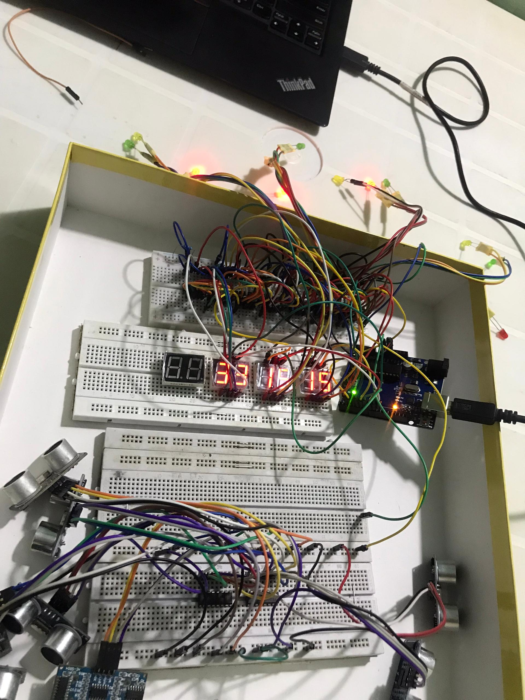
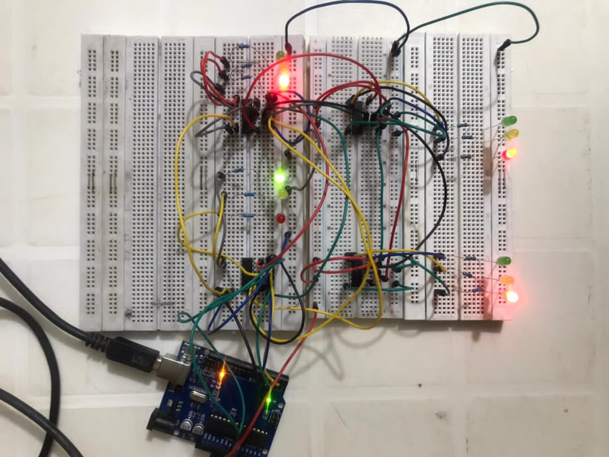
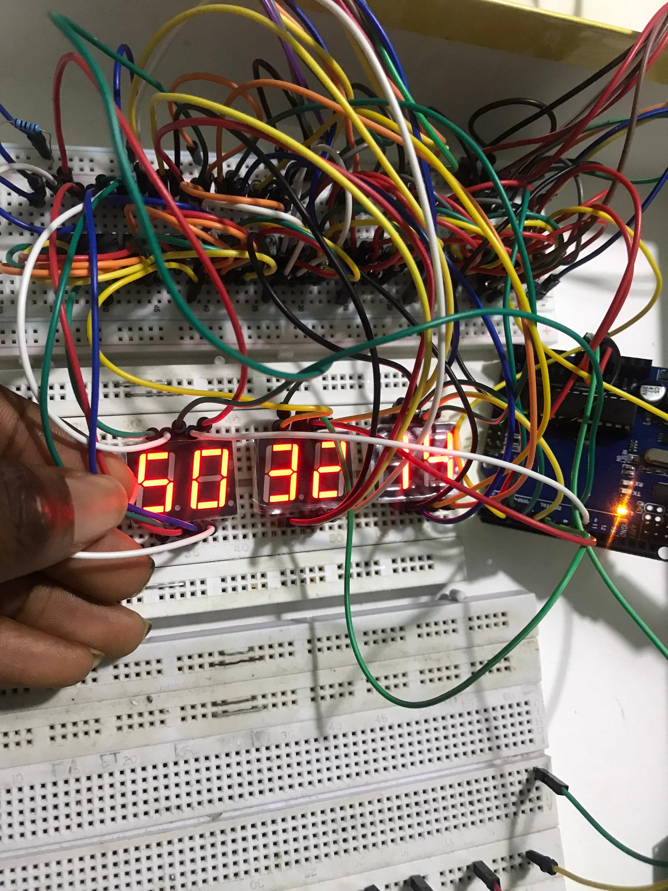
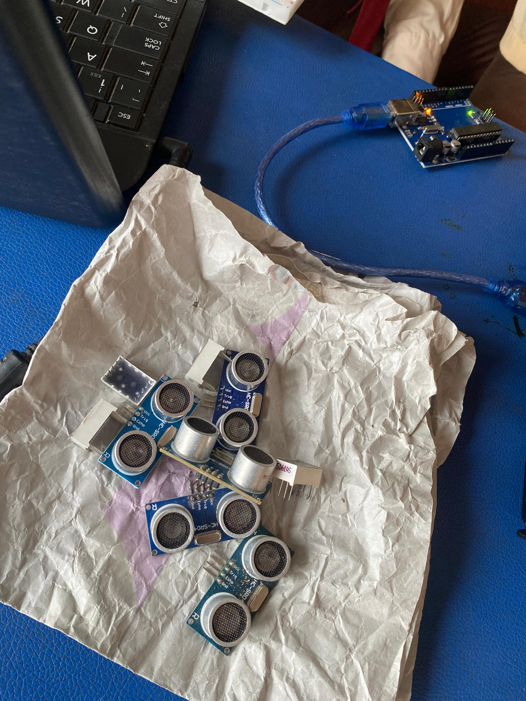
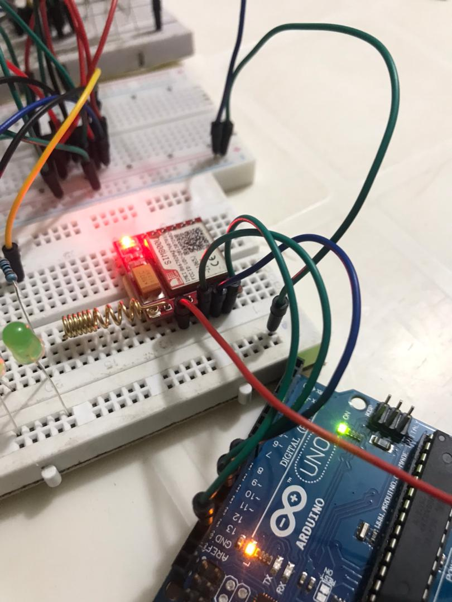

# ⚡ SMARTROAD BENIN : Système de Gestion de Feux Tricolores Adaptatifs

## 💡 Introduction et Équipe

Nous sommes l'équipe **SMARTROAD BENIN**, composée de cinq membres :
* **Max HOUNPATIN** (Chef d'équipe)
* **Daniel TADJIGBAN**
* **ZANNOU Loïc**
* **FADONOUGBO Alexis**
* **AGBOTON Fabio**

Notre projet a pour objectif de concevoir et réaliser un **système de gestion de feux de signalisation intelligent et adaptatif**. Il régule le flux de véhicules en temps réel en se basant sur la densité du trafic et intègre une fonction d'alerte d'urgence via GSM.

***

## 🛠️ Matériel Utilisé 

Cette section liste les composants matériels et outils essentiels à la conception du projet.

| Composant | Quantité | Rôle dans le Projet |
| :--- | :---: | :--- |
| **Microcontrôleur** (Arduino UNO ou compatible) | 1 | Cœur du système et exécution du code logique. |
| **Registres à Décalage 74HC595** | 8 | **Extension de sorties** : Contrôle des 4 feux tricolores et des 8 afficheurs 7 segments. |
| **Multiplexeur CD4051** | 1 | **Extension d'entrées** : Lecture des 8 capteurs ultrasons (HC-SR04). |
| **Capteurs Ultrasons HC-SR04** | 8 | Détection de la présence/densité des véhicules sur les 4 voies. |
| **Module GSM SIM800L** | 1 | Gestion de la communication d'urgence (envoi de SMS et appel). |
| **Afficheurs 7 Segments (Anode Commune)** | 8 | Affichage du temps d'attente pour chaque voie. |
| **LEDs (Rouge, Orange, Vert)** | 12 | Signalisation des feux tricolores. |
| **Bouton Poussoir** | 1 | Déclencheur manuel du mode Urgence. |

***

## 🔌 Schéma Électronique

Le schéma ci-dessous détaille le câblage complet du système, incluant les circuits d'extension d'E/S (74HC595 et CD4051), essentiels à la gestion des nombreuses entrées et sorties.

***

## 🖼️ Phases Clés de la Conception et Tests

Ces visuels illustrent les étapes importantes de notre processus de conception et de validation des modules.

### Tests des Périphériques et Intégration

* **Test du Câblage Général :**
    

  
* **Test des LEDs (Feux) :**
    

  
* **Test des Afficheurs 7 Segments :**
    

  
* **Test Ultrasons (Capteurs) :**
    

  
* **Programmation des Capteurs :**
    

  
* **Test Module SIM800L :**
    

***

## 💻 Code Source

Le code source complet du projet (Programme Arduino) est disponible dans le fichier :
**[`src`](./src)**

### Aperçu des Fonctionnalités Clés

| Fonction | Rôle |
| :--- | :--- |
| `lireCapteursEtAdapterTemps` | Détermine le **temps VERT dynamique** de la voie en fonction de la densité du trafic détectée. |
| `calculerTempsAttente` | Calcule le temps d'attente précis pour les voies au ROUGE (temps affiché sur les 8 digits). |
| `verifierUrgence` | Gère le déclenchement de l'alarme et l'envoi d'un SMS d'alerte via le **SIM800L**. |
| `afficherMultiplexe` | Assure l'affichage clair et non clignotant des **8 digits** par multiplexage temporel. |

***

## 🚀 Explication du Fonctionnement

Le système **SMARTROAD BENIN** fonctionne selon le principe du temps de feu dynamique :

1.  **Détection du Trafic :** À chaque cycle, les **8 capteurs ultrasons** (gérés par le **CD4051**) mesurent la densité du trafic sur les 4 voies.
2.  **Adaptation du Temps :** La fonction `lireCapteursEtAdapterTemps` ajuste la durée du feu vert de la voie active (minimum, léger, dense) en fonction des données des capteurs.
3.  **Affichage :** Les **8 registres 74HC595** gèrent simultanément l'allumage des feux (Rouge, Orange, Vert) et l'affichage du temps de compte à rebours sur les **8 digits** (multiplexage par la fonction `afficherMultiplexe`).
4.  **Mode Urgence :** Un appui long sur le bouton d'urgence déclenche la fonction `verifierUrgence`, qui passe tous les feux au rouge et envoie un SMS/Appel d'alerte aux secours via le **SIM800L**.

***

## 🗒️ Journal de Bord : Défis et Solutions

La conception d'un système intelligent multi-voies a présenté plusieurs défis techniques, résolus par des choix de composants d'extension d'E/S.

| Problème Rencontré | Solution Technique Apportée | Impact/Résultat |
| :--- | :--- | :--- |
| **Contrainte d'I/O pour les Sorties** (Feux et Afficheurs) : Le nombre total de sorties (plus de 70 bits) dépassait les capacités de l'Arduino. | Intégration de **8 Registres à Décalage 74HC595** en cascade. Ils permettent de contrôler toutes les sorties en utilisant seulement **trois broches** de l'Arduino. | Réduction drastique de la consommation de broches et succès dans le contrôle des 8 afficheurs par multiplexage. |
| **Contrainte d'I/O pour les Entrées** (8 Capteurs Ultrasons) : Nécessité de trop de broches pour gérer la lecture des 8 capteurs. | Utilisation du **Multiplexeur Analogique CD4051**. Ce circuit gère l'entrée `Echo` des 8 capteurs séquentiellement avec seulement **quatre broches** de l'Arduino. | Lecture des 8 capteurs en temps réel de manière efficace pour la détermination du trafic. |
| **Contrainte de Temps** : La densité des activités académiques a réduit le temps effectif de travail sur le projet. | Application d'une méthodologie de travail agile et division claire des tâches. | Le système a été rendu fonctionnel dans sa globalité, intégrant la logique adaptative et l'urgence GSM. |

***

## 👥 Répartition des Rôles et Contributions

| Membre de l'Équipe | Rôles Principaux | Contributions Spécifiques |
| :--- | :--- | :--- |
| **Max HOUNPATIN** | Chef de projet, Communication GSM | Gestion de la structure de code, implémentation et tests du module SIM800L. |
| **Daniel TADJIGBAN** | Hardware, Schéma Électronique | Conception du schéma de câblage, intégration physique des 74HC595. |
| **ZANNOU Loïc** | Programmation Affichage et Feux | Développement des fonctions de multiplexage (`afficherMultiplexe`) et gestion des séquences de feux. |
| **FADONOUGBO Alexis** | Logique Capteurs et Temps Dynamique | Implémentation de la lecture des ultrasons (CD4051) et de la fonction `lireCapteursEtAdapterTemps`. |
| **AGBOTON Fabio** | Documentation et Tests Fonctionnels | Rédaction des spécifications et validation des tests de l'ensemble du système. |

***

## 🏆 Démonstration Finale

Image de du système complet en fonctionnement.

***

## ✨ Fonctionnalités Bonus

Le projet **SMARTROAD BENIN** inclut la fonctionnalité bonus critique de la gestion des urgences :

* **Alerte GSM Intégrée :** En cas d'accident (simulé par un appui long sur le bouton), le module SIM800L envoie immédiatement un **SMS d'alerte** aux secours désignés et lance un **appel téléphonique**.
